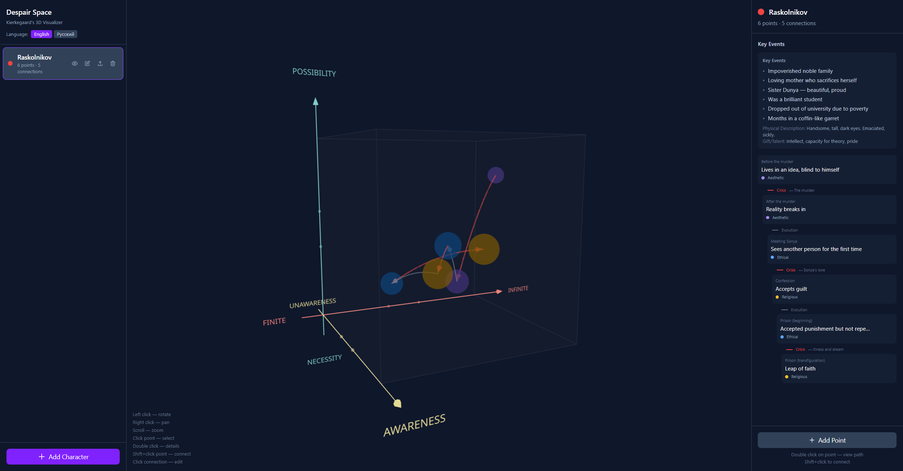
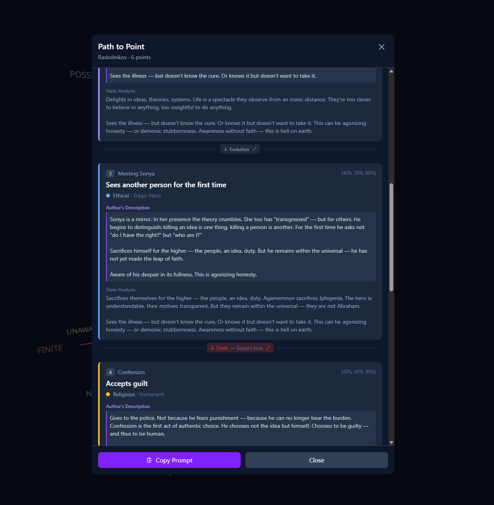
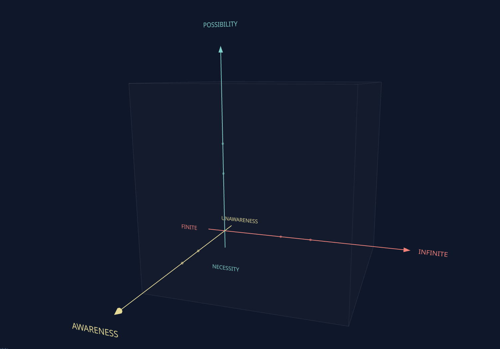
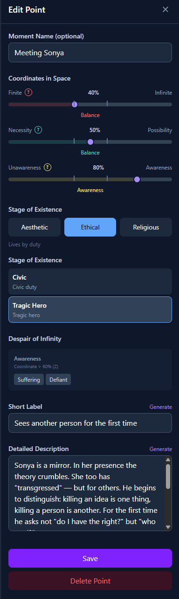

# Despair Space

**[Live Demo](https://YuriyKortev.github.io/despair_space/)**

A 3D visualization tool for mapping fictional characters' psychological states using Kierkegaard's philosophical model of despair.



## What is this?

**Despair Space** serializes character psychology into structured, machine-readable data. Instead of vague descriptions like "he felt lost," you get precise coordinates in a philosophical space that any LLM can interpret and expand upon.

Think of it as **version control for a character's soul**.

## The Problem It Solves

When writing fiction or working with AI to generate character moments, we often struggle to maintain psychological consistency. A character who was "broken" in chapter 3 shouldn't suddenly be "carefree" in chapter 5 without explanation.

**Despair Space** gives you:
- A structured way to track character development over time
- Exportable JSON that LLMs can understand and use for generation
- Visual representation of psychological trajectories
- Clear transitions between mental states (evolution, crisis, branching paths)

## Use Case: LLM-Powered Character Writing



1. **Map your character** in Despair Space — define their psychological journey through key moments
2. **Export ready prompt** — get a structured representation of their inner state
3. **Feed to an LLM** — ask it to generate internal monologue, dialogue, or scenes based on the exact psychological coordinates

### Example Prompt

```
# Despair Space: Beat Sheet + First-Person Phenomenology

Generate a beat sheet synopsis of the character's trajectory and one detailed first-person experience of the central event.

## Character: Raskolnikov

### Key Events
- **Key Events:** Impoverished noble family; Loving mother who sacrifices herself; Sister Dunya — beautiful, proud; Was a brilliant student; Dropped out of university due to poverty; Months in a coffin-like garret
- **Physical Description:** Handsome, tall, dark eyes. Emaciated, sickly.
- **Gift/Talent:** Intellect, capacity for theory, pride

### Context: Kierkegaard's Model of Despair

The space of despair has three axes (values from 0% to 100%):
- **Finite ↔ Infinite:** Finite — loss of self in the worldly. Infinite — loss of world in self.
- **Necessity ↔ Possibility:** Necessity — determinism, fatalism. Possibility — paralysis from excess options.
- **Unawareness ↔ Awareness:** Unawareness — unaware of despair. Awareness — acutely experiences their state.

Stages of existence:
- **Aesthetic** — Lives for the moment
- **Ethical** — Lives by duty
- **Religious** — Lives before God

## Character Trajectory (6 points)

### 1. Lives in an idea, blind to himself
**Moment Name (optional):** Before the murder

**Coordinates:**
- Finite ↔ Infinite: 90%
- Necessity ↔ Possibility: 80%
- Consciousness: 40%
**Stage of Existence:** Aesthetic (Intellectual)
**State:** Infinite: Cognition; Possibility: Paralyzed
**Description:** The theory of the "extraordinary man" has replaced reality. The old woman is not a person but a symbol, a "louse." He is not a murderer — he is an experimenter. The idea has so consumed him that the concrete (blood, axe, face) seems irrelevant. He doesn't know he is already in despair.

Accumulation of knowledge without application to one's own life. Can explain the structure of the universe but doesn't know how to live. Cognition becomes a way to avoid the existential question.

The most dangerous form of despair — because it is invisible. A person may be quite satisfied with life. They don't ask "who am I?" — and therefore cannot get an answer.

↓ **Crisis**: The murder
  _Alternatives (one per line): Become Napoleon, Break down_
```

The LLM now knows Ivan is:
- Lost in abstract thinking (high infinite, cognition subtype)
- Feeling trapped by circumstances (low possibility)
- Painfully aware of his situation (high consciousness, suffering)
- Living for intellectual stimulation (aesthetic-intellectual stage)

This produces far more consistent, psychologically rich output than "write a sad character."

## Theoretical Background

### Kierkegaard's Model of Despair

Søren Kierkegaard (1813-1855) proposed that human existence involves fundamental tensions. **Despair** isn't just sadness — it's a misrelation within the self, a failure to properly synthesize opposing aspects of existence.

### The Three Axes

| Axis | Low (0.0) | High (1.0) |
|------|-----------|------------|
| **Finite ↔ Infinite** | Lost in worldly concerns, conformity | Lost in abstraction, fantasy |
| **Necessity ↔ Possibility** | Fatalism, determinism | Paralysis of infinite choice |
| **Consciousness** | Unaware of one's despair | Acute awareness of one's condition |



### Subtypes

Each axis extreme has psychological subtypes:

**High Infinite (>0.6):**
- `imagination` — lost in fantasies
- `cognition` — lost in abstract thought
- `feeling` — detached, abstract emotions
- `will` — grand plans, no action

**Low Finite (<0.4):**
- `conformist` — does what everyone does
- `prudent` — narrow practicality

**High Possibility (>0.6):**
- `combinatorial` — endless hypotheticals
- `paralyzed` — unable to choose

**Low Necessity (<0.4):**
- `fatalist` — everything is predetermined
- `determinist` — scientific determinism

**High Consciousness (>0.6):**
- `suffering` — painful awareness
- `defiant` — rebellious awareness

**Low Consciousness (<0.4):**
- `naive` — genuine ignorance
- `busy` — distraction as escape
- `denial` — active self-deception

### Stages of Existence

Characters also exist within life-stages that shape how they relate to the world:

| Stage | Description | Subtypes |
|-------|-------------|----------|
| **Aesthetic** | Living for the moment, sensation, experience | `sensual`, `romantic`, `intellectual` |
| **Ethical** | Living by duty and universal principles | `civic`, `heroic` |
| **Religious** | Living in relation to the transcendent | `immanent`, `paradoxical` |




## Data Structure

Each character is a collection of **points** (psychological states) connected by **transitions**:

```typescript
Character {
  name: string
  color: string           // trajectory color in 3D space
  core: {
    history: string[]     // key life events
    body?: string         // physical description
    gift?: string         // talents/abilities
  }
  points: DespairPoint[]  // states in despair space
  connections: Connection[] // transitions between states
  rootPointId: string     // starting point
}

DespairPoint {
  coordinates: [finite↔infinite, necessity↔possibility, consciousness]
  subtypes: { ... }
  stage: aesthetic | ethical | religious
  stageSubtype: string
  label: string           // moment description
}

Connection {
  from → to
  transitionType: evolution | crisis | branch
  crisis?: {
    trigger: string       // what caused the change
    alternatives: string[] // paths not taken
  }
}
```

## Features

- **3D Visualization** — see character trajectories in philosophical space
- **Multiple Characters** — compare different psychological journeys
- **Preset Library** — start with literary archetypes (Raskolnikov, Hamlet, etc.)
- **Import/Export JSON** — portable, LLM-ready format
- **Connection Types** — model gradual evolution, sudden crises, or alternate paths
- **Bilingual** — English and Russian interface

## Getting Started

```bash
# Install dependencies
npm install

# Run development server
npm run dev

# Build for production
npm run build
```

## Tech Stack

- React 19 + TypeScript + Vite 7
- Three.js + @react-three/fiber + @react-three/drei
- Zustand 5 (state management)
- Tailwind CSS 4

## Example: Tracking a Character Arc

1. **Create character** — give them a name and color
2. **Add starting point** — where do they begin psychologically?
3. **Add crisis points** — moments of change with triggers and alternatives
4. **Connect the dots** — define how they moved between states
5. **Export** — get JSON for your writing or LLM prompts

## License

MIT

---

*"The most common form of despair is not being who you are."*
— Søren Kierkegaard
